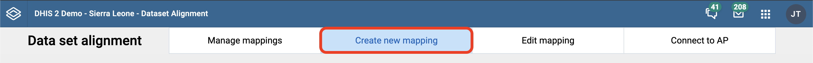
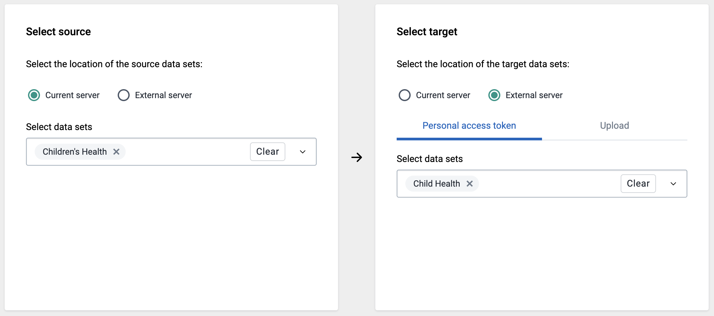
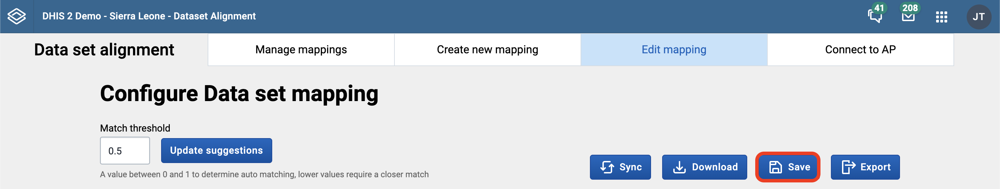
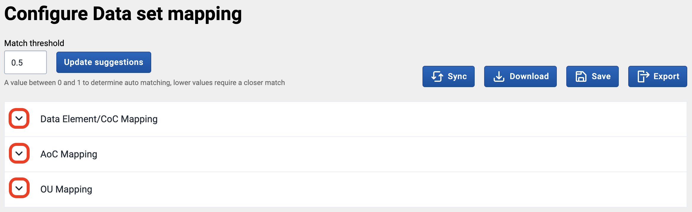
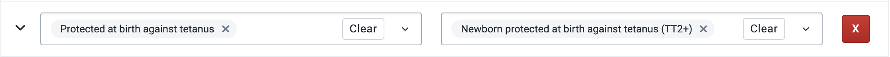
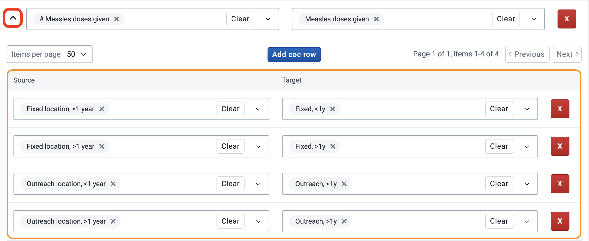
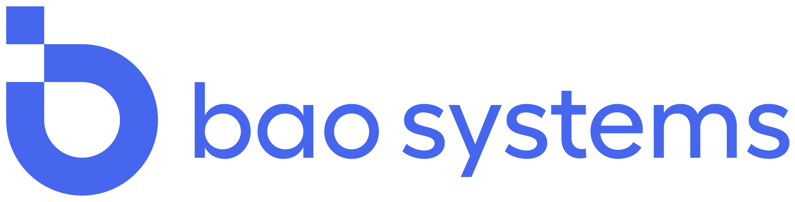
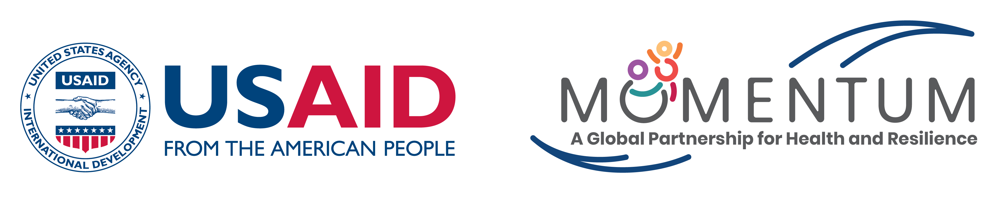

# Dataset Alignment

The Dataset alignment app speeds up the process of aligning metadata between data sets to support data transfer. By using a fuzzy matching algorithm, the app is able to suggest mappings between the source and target data sets, meaning the majority of the mapping can be automated, saving large amounts of time.

_(Developed by BAO Systems)_

## Installation

Github release: [here](https://github.com/baosystems/metadata-alignment/releases/) OR  
App platform release: [here](https://apps.dhis2.org/app/239b58bb-0e3a-4183-b9b4-29956328c2a1)

## User Guide

After installing, the app can be accessed via the DHIS2 app menu like any other native DHIS2 application.

### Creating a new mapping

1. To create a new mapping, first navigate to the 'Create new mapping' tab:  
   
1. Next, select where the source and target data sets are located:  
   
   - For 'Current server' selections, select the desired data set
   - For 'External server' selections, the required [CORS whitelist](https://docs.dhis2.org/en/use/user-guides/dhis-core-version-239/configuring-the-system/system-settings.html?h=cors+whitelist+2.39#system_access_settings:~:text=12%20or%2014.-,CORS%20whitelist,-Whitelists%20a) and [server settings](<https://docs.dhis2.org/en/use/user-guides/dhis-core-version-239/working-with-your-account/personal-access-tokens.html?h=personal+access+token+2.39#server-configuration:~:text=%2C%0A%20%20%20%20%7D%2C%0A%7D)%3B-,Server%20configuration,-%C2%B6>) must be enabled to allow personal access token connections, then a personal access token must be created on the external server. If this is not possible, then use the 'Upload' method  
     
1. Once a source and target data set has been selected, click 'Configure mapping' to create a new mapping
1. Once the mapping has been generated, make sure to click the save button so the configuration is saved  
   

### Configuring a mapping

On the edit mapping page there are a number of buttons:

- **Update suggestions**: This will cause the app to re-run it's suggestion algorithm on the mapping, based on the match threshold (0.5 by default which is run automatically for new mappings). Higher values will increase the number of suggestions (will suggest values that are more different)
- **Sync**: This will apply any changes to the source and target data sets to the mapping
- **Download**: This will download the mappings as CSV files which can be used to transfer the data via SQL, or scripts using the API
- **Save**: This will save the mapping so it can be accessed later
- **Export**: This will send the mapping to the Analytics platform if the user is connected

Each metadata type (DEs, AOCs and OUs) have their own mapping tables, which can be viewed by clicking the arrow on the left hand side:  

When these tables are expanded, you will see a list of rows, one for each of the metadata items on the source. There may also be a value in the target column on the right if the app has made a suggestion or one has been manually populated.  
  
Mapping items can be added or removed using the small grey 'x' on the item itself. Clicking clear will remove all the items in the field, and the red 'X' will delete the row entirely.

For each data element mapping, there is also a corresponding list of COC mappings, these can be found by clicking the arrow on the left hand side of the data element mapping row. This table only becomes populated when both a source and target data element have been selected:  

To generate more suggestions you can increase the threshold value then click 'Update suggestions'

Once all the desired fields have been mapped, make sure to click the save button so your changes are kept.

## Demo

[Video](https://github.com/baosystems/metadata-alignment/releases/download/v1.10.1/DataSetAlignement.mp4)

## Acknowledgements

_This app is developed by BAO Systems and is made possible by the U.S. Agency for International Development (USAID) and MOMENTUM Country and Global Leadership, led by Jhpiego and partners, and does not reflect the views of USAID or the United States Government._

This project was bootstrapped with the [DHIS2 Application Platform](https://github.com/dhis2/app-platform).
